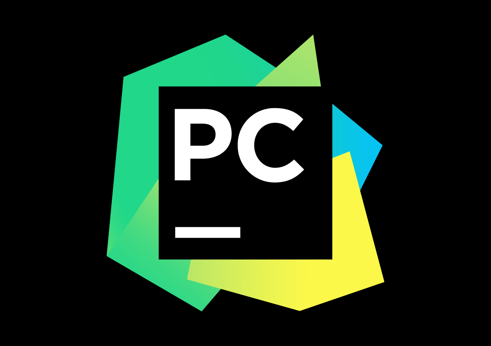
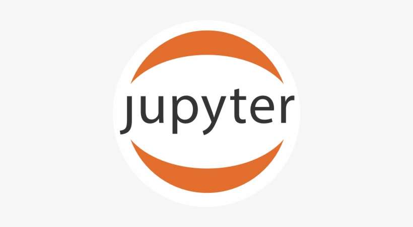

<!--
### Hi there 👋
**specter25/specter25** is a ✨ _special_ ✨ repository because its `README.md` (this file) appears on your GitHub profile.

Here are some ideas to get you started:

- 🔭 I’m currently working on ...
- 🌱 I’m currently learning ...
- 👯 I’m looking to collaborate on ...
- 🤔 I’m looking for help with ...
- 💬 Ask me about ...
- 📫 How to reach me: ...
- 😄 Pronouns: ...
- ⚡ Fun fact: ...
-->

### Hey 👋🏽, I'm Kartik Sood 

 
 

Hi I'm Kartik Sood, currently in my Final Year at Thapar Institute of Engineering and Technology. About my technical skills, I have been exploring and working in the exciting fields of Web Development, Generative Ai and Machine Learning. I am a former Software Engineer Intern [@Prodapt](https://www.linkedin.com/company/prodapt/). Apart from Programming, I enjoy gaming with my friends, watching and playing football, and watching Stand-up comedy and sit-coms!

  
**Diving Deeper into my Profile:**

- ⚡️ Fun Fact: I am a Martial Arts Black Belt!
- 👨🏽‍💻 I’m currently working on Web Development.
- 🌱 I’m eager to learn more about Generative AI.
- 👯 I’m looking to collaborate on Web Development projects 🤝.
- 💬 Ask me about anything, I am happy to help.
- 📫 How to reach me: kartiksood2002@gmail.com.

**Languages and Tools:**

<code></code>
<code></code>
<code></code>
<code></code>
<code></code>
<code></code>
<code></code>
<code></code>
<code></code>
<code></code>
<code></code>
<code></code>
<code></code>
<code></code>
<code></code>
<code></code>
<code></code>
<code></code>
<code></code>
<code></code>
<code></code>
<code></code>
<code></code>
<code></code>

